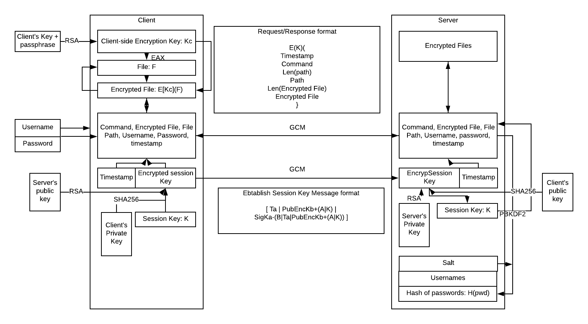

# file-transfer-protocol

This is the implement of Secure File Transfer Protocol. The protocol follow this scheme

## network.py

network.py will initialize client's and server's credential, which included client's key pairs and server key pairs for session key ebtablsihment, username and password, salt and hash of the password on server, client's key for client-side encryption of file, and client file system on the server.

network.py must be run first to enable communication between client.py and server.py

## client.py

client.py simulate client. User first enter their password for user authentication and passphrase to obtain client's key. Client first ebstablish the session key by creating a session key, encrypt it with server public key and sign the encrypted key with client private key. Username, password, encrypted session key and its signature is format as spcified in the scheme. When the server confirm that the session key have been entablished, the client can initiate file transfer protocol. Client is asked to enter command, path (optional), file, in form of text message (optional). If client enter a file, the client will create a key to encrypt the file using AES in EAX mode, and use client's key to encrypt the key; the encrypted key is attached to the encrypted file and send to the server in the message format specified in the scheme.

## server.py

server.py simulate a server. When the server receive message from client to ebtablish the session key, the server decrypt the session key using server's private key and verify the signature using client's public key. The server hash th epassword and check it with the database to authenticate user, and then send back a message confirm session key ebstablishment. The server recieve message from the client and process the request accordingly.
